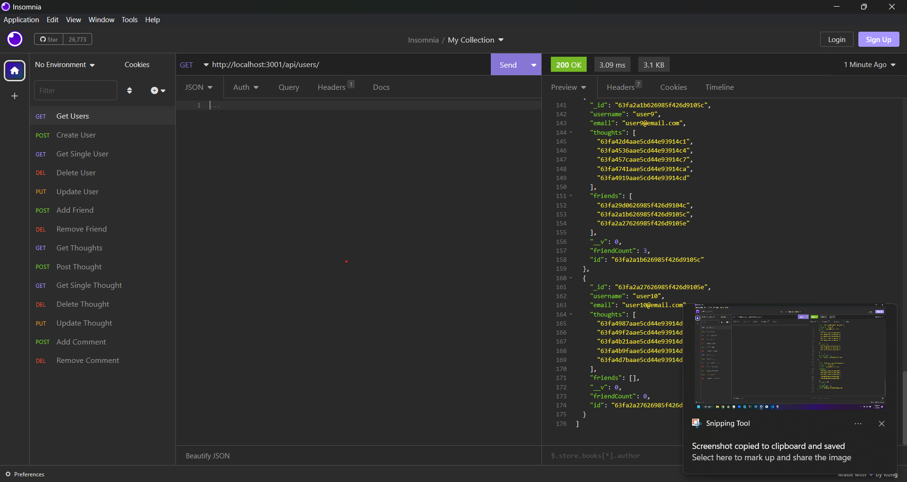
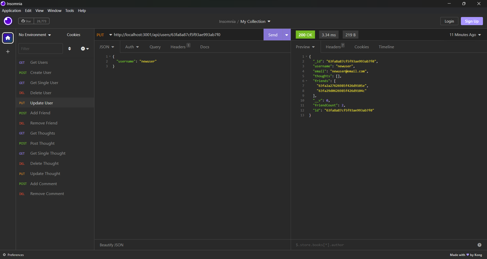
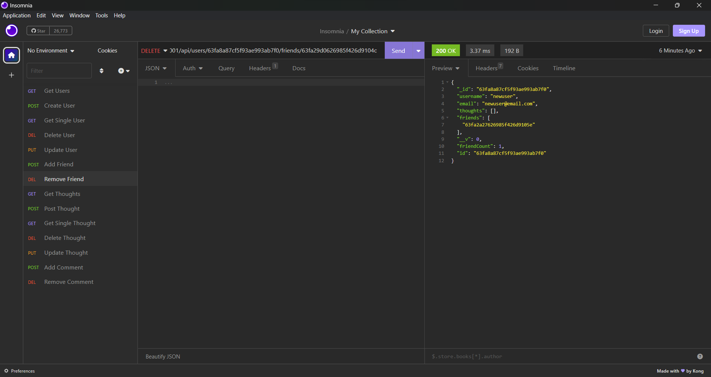
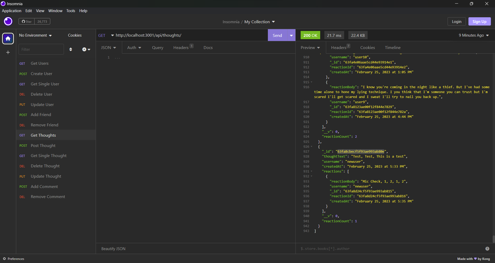
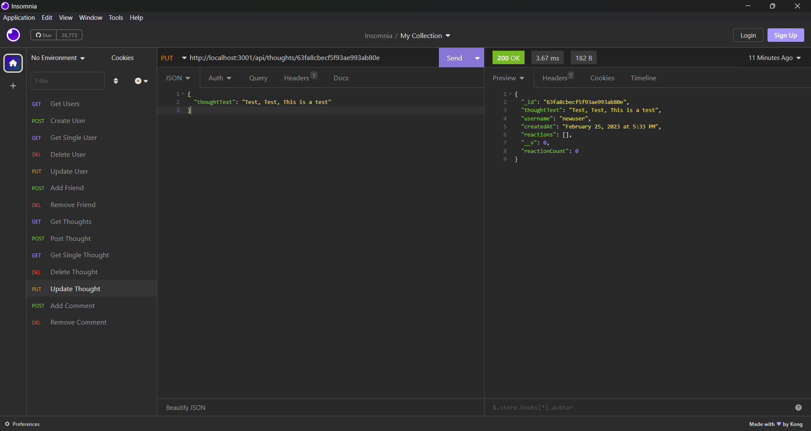
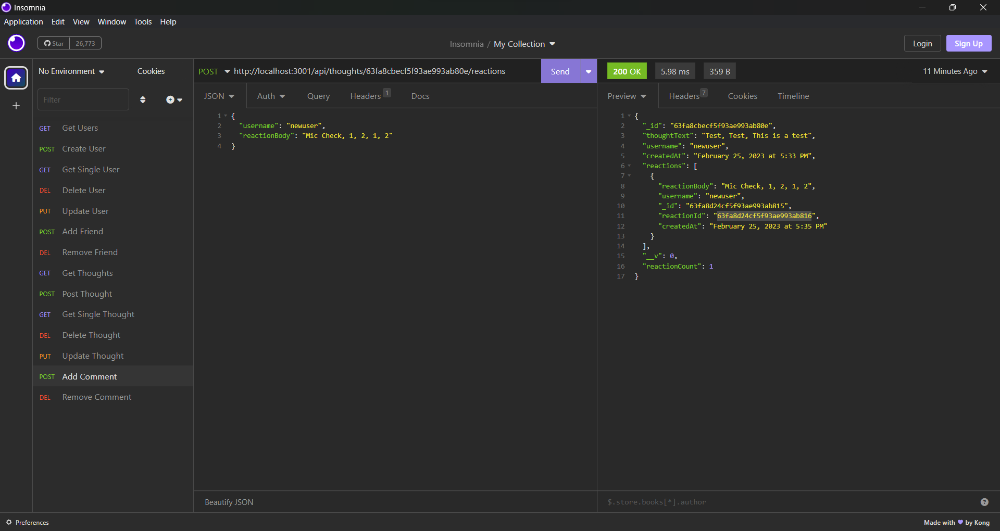
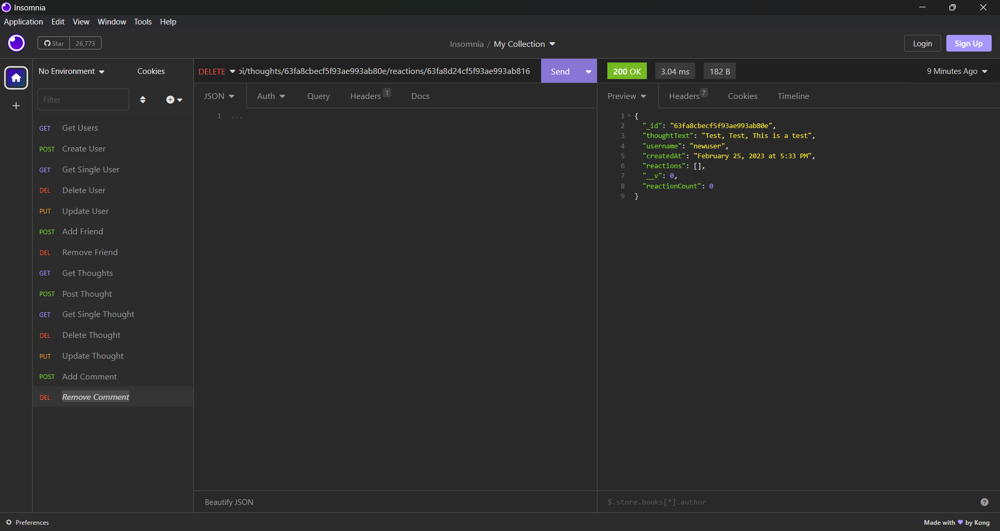

# A-Social-P-Network-I

## Description

This is an API for a social network where users can share their thoughts, react to friends’ thoughts, and create a friend list.

## Table of Contents

- [Installation](#installation)
- [Usage](#usage)
- [Link](#link)
- [Walkthrough](#walkthrough)
- [Screenshots](#screenshots)
- [License](#license)
- [Contributing](#contributing)
- [Tests](#tests)
- [Questions](#questions)

## Installation

Clone the repo from github. Navigate to the main folder in the command line. Then run npm install.

## Usage

Start the application by running npm start or node index.js in the main folder. Then you can perform all the different routes for both users and thoughts. There are GET, POST, PUT, AND DELETE ROUTES for both models.

## Link

[Repository](https://github.com/hvansalisbury/A-social-P-network-I)

## Walkthrough

[Walkthrough Video](https://drive.google.com/file/d/1j_Th_SwDva4UPvRT_BNOnN6m-dPzN0bg/view)

## Screenshots

## License

This application is covered under the [MIT License](https://choosealicense.com/licenses/mit) license.

## Contributing

At this time, I am not looking for any additional contributors for this project.

## Tests

Run all of the different routes and make sure they all return the expected values.

## Questions

Should you have any questions, please [email](vansal51@yahoo.com) me and reach out to me on my [Github Profile](https://github.com/hvansalisbury)
